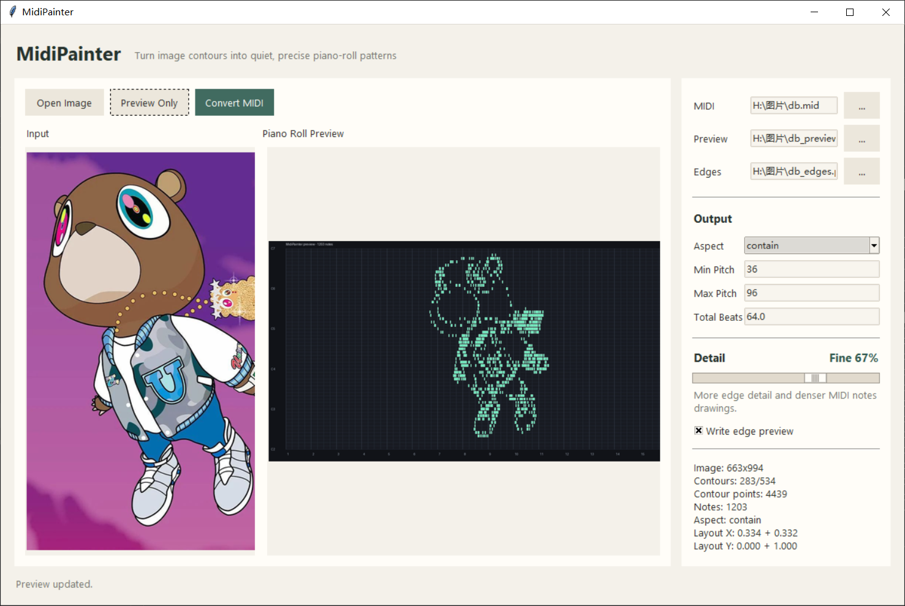

# MidiPainter

**把图片轮廓转换成 MIDI Piano Roll 图案。**

MidiPainter 可以读取图片中的可见轮廓，并把它们转换成标准 `.mid` 文件。把导出的 MIDI 放进 DAW 后，音符会在钢琴窗里形成接近原图的图案。

[English README](README.md)

## 效果展示




## 它能做什么

- 将图片转换成 MIDI Piano Roll 图案。
- 导出标准 `.mid` 文件，可导入 DAW 或 MIDI 编辑器。
- 在打开 DAW 前先查看 Piano Roll 预览图。
- 可选生成边缘检测预览，方便确认软件识别到了哪些轮廓。
- 使用 `contain` 模式保持原图比例，或使用 `stretch` 模式铺满整个 Piano Roll 范围。
- 在桌面界面中调整音域、时间长度和图案细节。


## 快速开始

1. 打开 `MidiPainter.exe`。
2. 点击 **Open Image**，选择 PNG、JPG、JPEG、WEBP 或 BMP 图片。
3. 按需要调整 **Aspect**、**Pitch Range**、**Total Beats** 和 **Detail**。
4. 点击 **Preview Only** 生成 Piano Roll 预览。
5. 点击 **Convert MIDI** 导出 `.mid` 文件。
6. 将 `.mid` 文件导入你的 DAW。

## 效果建议

- 使用轮廓清晰、对比度较高的图片。
- 简单 logo、图标、线稿、插画、人像通常比复杂照片更适合。
- 想保持原图比例时使用 `contain`。
- 想铺满整个钢琴窗区域时使用 `stretch`。
- 提高 Detail 会保留更多轮廓，但音符也更多；降低 Detail 会更干净、更轻量。
- 如果 DAW 里的图案看起来比预览更宽或更高，可以调整 DAW 缩放或尝试不同的时间长度。

## 桌面应用

推荐优先使用桌面应用。它包含：

- 输入图片预览
- Piano Roll 预览
- MIDI 导出
- 可选的边缘检测预览
- 输出路径设置
- 图片比例模式选择
- 音域和时间长度控制
- Detail 滑杆，用于平衡干净输出和细节密度
- 轮廓数量、音符数量等转换统计信息

## 命令行用法

MidiPainter 也提供 CLI，适合重复处理或脚本化转换。

基础转换：

```powershell
python -m midipainter input.png output.mid
```

同时生成 MIDI 和预览图：

```powershell
python -m midipainter input.png output.mid `
  --preview piano_roll.png `
  --edge-preview edges.png
```

常用参数：

```powershell
python -m midipainter input.png output.mid `
  --preview piano_roll.png `
  --edge-preview edges.png `
  --min-pitch 36 `
  --max-pitch 96 `
  --total-beats 64 `
  --note-beats 0.125 `
  --quantize-beats 0.125 `
  --velocity 84 `
  --aspect-mode contain `
  --display-aspect 2.012 `
  --max-width 512 `
  --canny-low 80 `
  --canny-high 180 `
  --min-contour-points 4 `
  --min-contour-area 8 `
  --max-contours 512 `
  --simplify-epsilon 1.5 `
  --sample-step 2 `
  --max-notes 5000
```

## 从源码运行

环境要求：

- Python 3.9 或更高版本
- Windows 或 macOS
- 用于打开 `.mid` 文件的 DAW 或 MIDI 编辑器

安装并运行：

```powershell
python -m pip install -e .
python -m midipainter.app
```

运行测试：

```powershell
python -m pytest
```

## 当前限制

- 过于复杂的图片可能生成大量音符，部分 DAW 处理起来会比较重。
- 背景杂乱的图片可能产生不需要的轮廓。
- 最终显示效果会受到 DAW 缩放、音符高度和钢琴窗显示设置影响。
- 目前 Windows 是第一个打包目标，macOS 安装包尚未提供。

## 路线图

- 更好的背景清理和主体分离。
- 支持 SVG/path 输入，以获得更干净的源轮廓。
- 增加音阶吸附、velocity 映射等可选音乐化功能。
- 支持基于颜色的多轨 MIDI 导出。
- 提供 macOS 打包版本。


## License

MIT License. See [LICENSE](LICENSE).
